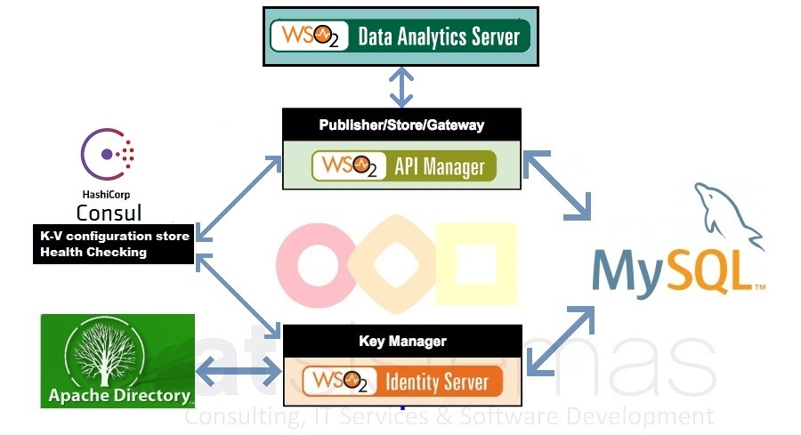

# Ejemplo de uso de docker con API Manager 2.1.0 - Identity Server 5.3.0 - Data Analytics 3.1.0
Este ejemplo esta montado con API Manager 2.1.0, Identity Server 5.3.0, Data Analytics 3.1.0, utilizando como BD MySQL, apoyandose en consul, para chequeo de salud y almacenamiento de configuración, y ApacheDS como servidor de servicios de directorio.




## Pre-requisitos

 * Docker 
 * Docker compose
 * Copiar
 

Origen | Destino 
-------- | -------------- 
curl -C - -L -O -# -H "Cookie: oraclelicense=accept-securebackup-cookie" http://download.oracle.com/otn-pub/java/jdk/8u144-b01/090f390dda5b47b9b721c7dfaa008135/jdk-8u144-linux-x64.rpm | wso2-am/deps/am/packages
curl -C - -L -O -# -H "Cookie: oraclelicense=accept-securebackup-cookie" http://download.oracle.com/otn-pub/java/jdk/8u144-b01/090f390dda5b47b9b721c7dfaa008135/jdk-8u144-linux-x64.rpm | wso2-is/deps/is/packages
curl -C - -L -O -# -H "Cookie: oraclelicense=accept-securebackup-cookie" http://download.oracle.com/otn-pub/java/jdk/8u144-b01/090f390dda5b47b9b721c7dfaa008135/jdk-8u144-linux-x64.rpm | wso2-das/deps/das/packages
curl -C - -L -O -# -H "Cookie: oraclelicense=accept-securebackup-cookie" http://download.oracle.com/otn-pub/java/jdk/8u144-b01/090f390dda5b47b9b721c7dfaa008135/jdk-8u144-linux-x64.rpm | apacheds/deps/ldap/packages
curl -O  -A "testuser" -H "Referer: http://connect.wso2.com/wso2/getform/reg/new_product_download" https://product-dist.wso2.com/products/api-manager/2.1.0/wso2am-analytics-2.1.0.zip | wso2-am/deps/am
http://product-dist.wso2.com/downloads/api-manager/2.1.0/identity-server/wso2is-km-5.3.0.zip | wso2-is/deps/is
curl -O  -A "testuser" -H "Referer: http://connect.wso2.com/wso2/getform/reg/new_product_download" https://product-dist.wso2.com/products/data-analytics-server/3.1.0/wso2das-3.1.0.zip | wso2-das/deps/das

## Como lanzarlo

```docker-compose pull```

```docker-compose up ```

Esto despliega lo siguiente,

* **[Consul][consul]** Agrupa multiples componentes los utilizados son :
    * **Detección de fallos** Realiza un chequeo de salud identificando posibles fallos.
    * **Almacenamiento KV** Almacenamiento de pares key/value para configuración dinámica.  
* **[Mysql server][mysql]** Sistema de gestión de bases de datos relacional, cargada con las bd apimdb, userdb, regdb, necesarias para la ejecución de productos del ecosistema de WSO2.
* **[ApacheDS][apacheds]** Servidor de servicios de directorio.
* **[API Manager][apim]** Solución que permite la creación, publicación y gestión de todos lo relacionados con las API's y su ciclo de vida. Contiene:
    * **Publisher**: Aplicación que permite publicar APIs, gestionarlas y documentarlas.
    * **Store**: Aplicación utilizada como catálogo de APIs que permite la suscripción a las APIs para las cuales tenemos permiso.
    * **Gateway**: Actúa como un proxy que intercepta las peticiones entrantes y aplica políticas de seguridad y disponibilidad.
* **[Identity Server][identity]** Producto que actua como **Key Manager** del API Manager,  gestiona la seguridad y los tokens de acceso.
* **[Data analitycs][analytics]** Producto que permite el análisis de flujos de datos procedentes del API Manager.


### Como probar

Añadir las siguientes entradas a /etc/hosts o a C:\Windows\System32\drivers\etc\hosts
```
127.0.0.1 api-manager is-key-manager apim_db consul am-analytics
```

### Como acceder al entorno
**Consul**
```
http://consul:8500
```

**Publisher**
```
https://api-manager/publisher
```

**Store**
```
https://api-manager/store/
```

**Gateway Manager**
```
https://api-manager/carbon/
```

**Machine Learner**
```
https://am-analytics:9445/ml/
```

**Dashboard Server**
```
https://am-analytics:9445/portal/dashboards/
```

## Pasos seguidos para montar el entorno
* Integración **API Manager** con **Identity Server** y **MySQL**

   Se ha seguido el proceso indicado en [Configuring WSO2 Identity Server as a Key Manager][ISAM]

* Integración de **API Manager** con **Data Analytics**

  Se ha seguido el proceso indicado en [Configuring APIM Analytics][ANAM]

* Procedimiento seguido para añadir un dominio al KeyStore

    * Crear un KeyStore incluyendo el dominio como Common Name (CN)
    
     ```sh 
    keytool -genkey -alias at -keyalg RSA -keystore  at.jks -keysize 2048
    ```
    ```sh
     Enter keystore password:wso2carbon
     Re-enter new password: wso2carbon
     What is your first and last name?
     [Unknown]:  api-manager
     What is the name of your organizational unit? 
     [Unknown]:
     What is the name of your organization? 
     [Unknown]:  atSistemas
     What is the name of your City or Locality? 
     [Unknown]:  MAD
     What is the name of your State or Province? 
     [Unknown]:  MAD
     What is the two-letter country code for this unit? 
     [Unknown]:  ES
     Is CN=api-manager, OU=Unknown, O=atSistemas, L=MAD, ST=MAD, C=ES correct? 
    [no]:  yes
    Enter key password for <wso2carbon>
    (RETURN if same as keystore password):  wso2carbon
    Re-enter new password: wso2carbon
    ```
    
    * Configurar el SSL KeyStore
    ```sh
    keytool -export -alias at -file at -keystore at.jks -storepass wso2carbon
    keytool -import -alias at -file at -keystore client-truststore.jks -storepass wso2carbon
    ```

    Actualizar los parametros KeyStoreFile y KeyStorePass del conector HTTPS de Tomcat
    Cambiar el parametro keystoreFile y keystorePass del Server.Service.Connector para el puerto 9443 en el fichero <PRODUCT_HOME>/repository/conf/tomcat/catalina­server.xml dejandolo como sigue.
    ```sh
    .........
     <Connector protocol=”org.apache.coyote.http11.Http11NioProtocol”
     port=”9443"
     ......
     keystoreFile=”${carbon.home}/repository/resources/security/at.jks”
     keystorePass=”wso2carbon”
     URIEncoding=”UTF-8"/>
     ........
    ```
    * Configurar el api manager
    Actualizar los valores de <Password>, <KeyAlias>, <KeyPassword> del campo <KeyStore> en el fichero <PRODUCT_HOME>/repository/conf/carbon.xml .
    
    ```sh
    <KeyStore>
        <!-- Keystore file location-->
        <Location>${carbon.home}/repository/resources/security/at.jks</Location>
        <!-- Keystore type (JKS/PKCS12 etc.)-->
        <Type>JKS</Type>
        <!-- Keystore password-->
        <Password>wso2carbon</Password>
        <!-- Private Key alias-->
        <KeyAlias>at</KeyAlias>
        <!-- Private Key password-->
        <KeyPassword>wso2carbon</KeyPassword>
    </KeyStore>
    ```
[apim]: https://wso2.com/api-management/
[consul]: https://www.consul.io/
[mysql]: https://www.mysql.com/
[identity]: https://wso2.com/identity-and-access-management
[analytics]: https://wso2.com/analytics
[apacheds]: http://directory.apache.org/apacheds/
[ISAM]: https://docs.wso2.com/display/AM210/Configuring+WSO2+Identity+Server+as+a+Key+Manager
[ANAM]: https://docs.wso2.com/display/AM210/Configuring+APIM+Analytics
